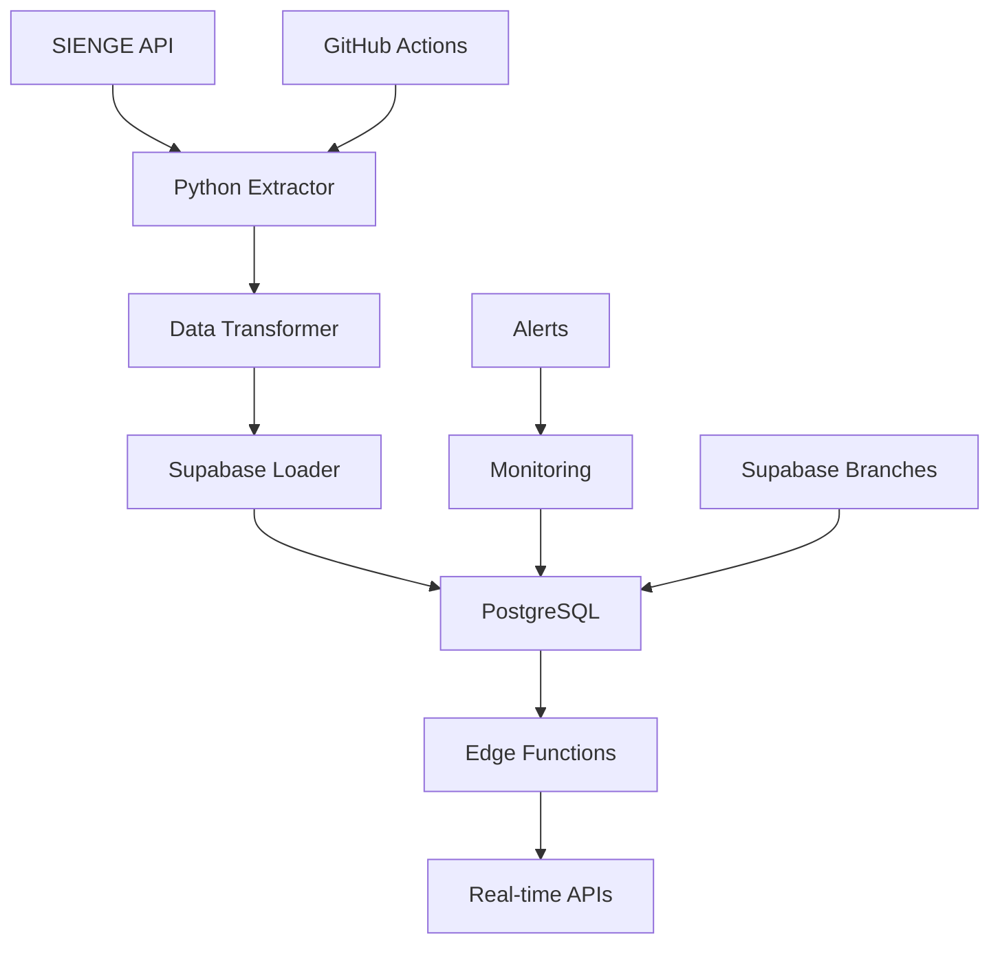

# Plano Robusto de Integração SIENGE-Supabase
## Utilizando Model Context Protocols (MCPs)

---

## 📋 SUMÁRIO EXECUTIVO

Este documento apresenta um plano estratégico para integração completa entre o sistema ERP SIENGE e a plataforma Supabase, aproveitando as capacidades avançadas dos MCPs disponíveis para automação, desenvolvimento ágil e deploy contínuo.

### 🎯 Objetivos Principais
- **Sincronização Bidirecional**: Dados entre SIENGE e Supabase
- **Automação Completa**: Workflows de ETL e processamento
- **Monitoramento em Tempo Real**: Logs, alertas e métricas
- **Escalabilidade**: Arquitetura preparada para crescimento
- **Manutenibilidade**: Código organizado e documentado

---

## 🏗️ ARQUITETURA DA SOLUÇÃO

### Componentes Principais

```
SIENGE API ←→ MIDDLEWARE (Python/Deno) ←→ SUPABASE
     ↓              ↓                        ↓
   ERP Data    Processing Layer         Cloud Database
               - ETL Scripts            - PostgreSQL
               - Validation             - Real-time APIs
               - Transformation         - Edge Functions
               - Error Handling         - Auth & Security
```

### Stack Tecnológica
- **Backend**: Supabase (PostgreSQL + Edge Functions)
- **Middleware**: Python Scripts + Deno Edge Functions
- **Controle de Versão**: GitHub com MCPs
- **Automação**: MCPs nativos do Supabase
- **Monitoramento**: Logs do Supabase + Alertas customizados

---

## 🚀 FASES DE IMPLEMENTAÇÃO

## FASE 1: INFRAESTRUTURA E SETUP (Semana 1-2)

### 1.1 Configuração do Ambiente Supabase
```bash
# Usando Supabase MCP
- list_organizations → Verificar organizações disponíveis
- get_cost → Calcular custos do projeto
- confirm_cost → Confirmar orçamento
- create_project → Criar projeto Supabase
```

### 1.2 Estruturação do Repositório
```bash
# Usando GitHub MCP
- create_branch "development" → Branch de desenvolvimento
- create_branch "staging" → Branch de homologação
- push_files → Setup inicial de arquivos
```

### 1.3 Configuração de Branches de Desenvolvimento
```bash
# Usando Supabase MCP
- create_branch "develop" → Ambiente de desenvolvimento
- list_branches → Verificar branches criadas
```

### 🛠️ Entregáveis Fase 1:
- [ ] Projeto Supabase configurado
- [ ] Repositório GitHub estruturado
- [ ] Ambientes de desenvolvimento/staging criados
- [ ] Documentação inicial

---

## FASE 2: ANÁLISE E MAPEAMENTO DE DADOS (Semana 2-3)

### 2.1 Descoberta da API SIENGE
```bash
# Usando Firecrawl MCP
- deep_research "SIENGE API documentation" → Pesquisa aprofundada
- scrape [URLs da documentação] → Extração de documentação
- extract → Estruturação de dados sobre endpoints
```

### 2.2 Análise de Estruturas de Dados
```python
# Scripts de análise usando ferramentas básicas
- codebase_search "endpoint analysis" → Buscar análises existentes
- read_file "scripts-antigos/*.py" → Revisar scripts legados
- web_search "SIENGE API best practices" → Pesquisar melhores práticas
```

### 2.3 Design do Schema de Banco
```sql
# Usando Supabase MCP
- apply_migration "create_sienge_schema" → Criar schema inicial
- list_tables → Verificar tabelas criadas
- generate_typescript_types → Gerar tipos TypeScript
```

### 🛠️ Entregáveis Fase 2:
- [ ] Mapeamento completo da API SIENGE
- [ ] Schema de banco de dados definido
- [ ] Tipos TypeScript gerados
- [ ] Documentação técnica da integração

---

## FASE 3: DESENVOLVIMENTO DO MIDDLEWARE (Semana 3-5)

### 3.1 Scripts de Extração de Dados
```python
# Usando ferramentas de desenvolvimento
- edit_file "src/extractors/sienge_extractor.py" → Extrator principal
- edit_file "src/transformers/data_transformer.py" → Transformador de dados
- edit_file "src/loaders/supabase_loader.py" → Carregador para Supabase
```

### 3.2 Edge Functions para Processamento
```typescript
# Usando Supabase MCP
- deploy_edge_function "process-sienge-data" → Função de processamento
- deploy_edge_function "data-validation" → Validação de dados
- deploy_edge_function "error-handler" → Tratamento de erros
```

### 3.3 Sistema de Monitoramento
```python
# Logs e alertas
- edit_file "src/monitoring/logger.py" → Sistema de logs
- edit_file "src/monitoring/alerts.py" → Sistema de alertas
```

### 🛠️ Entregáveis Fase 3:
- [ ] Scripts de ETL funcionais
- [ ] Edge Functions deployadas
- [ ] Sistema de logs implementado
- [ ] Testes unitários e de integração

---

## FASE 4: IMPLEMENTAÇÃO DE SINCRONIZAÇÃO (Semana 5-6)

### 4.1 Sincronização Inicial (Full Load)
```python
# Carga completa de dados históricos
- execute_sql "TRUNCATE sienge_staging" → Limpar staging
- run_terminal_cmd "python src/full_sync.py" → Sincronização completa
- get_logs "postgres" → Verificar logs do banco
```

### 4.2 Sincronização Incremental
```python
# Atualização contínua
- deploy_edge_function "incremental-sync" → Sync incremental
- apply_migration "add_sync_control_tables" → Tabelas de controle
```

### 4.3 Validação de Dados
```python
# Verificação de integridade
- execute_sql "SELECT validate_data_integrity()" → Validar integridade
- deploy_edge_function "data-quality-check" → Verificação de qualidade
```

### 🛠️ Entregáveis Fase 4:
- [ ] Sincronização inicial executada
- [ ] Processo de sincronização incremental
- [ ] Validação de integridade implementada
- [ ] Dashboard de monitoramento

---

## FASE 5: AUTOMAÇÃO E CI/CD (Semana 6-7)

### 5.1 Workflows Automatizados
```yaml
# Usando GitHub MCP
- create_or_update_file ".github/workflows/deploy.yml" → Workflow de deploy
- create_or_update_file ".github/workflows/sync.yml" → Workflow de sincronização
```

### 5.2 Testes Automatizados
```python
# Suite de testes
- edit_file "tests/test_integration.py" → Testes de integração
- edit_file "tests/test_data_quality.py" → Testes de qualidade
- run_terminal_cmd "pytest tests/" → Executar testes
```

### 5.3 Deploy Automatizado
```bash
# Pipeline de deploy
- merge_branch → Merge development para main
- get_logs "edge-function" → Verificar logs de deploy
```

### 🛠️ Entregáveis Fase 5:
- [ ] Pipeline CI/CD configurado
- [ ] Testes automatizados funcionais
- [ ] Deploy automatizado implementado
- [ ] Monitoramento de performance ativo

---

## FASE 6: OTIMIZAÇÃO E PRODUÇÃO (Semana 7-8)

### 6.1 Performance e Otimização
```sql
# Usando Supabase MCP
- execute_sql "CREATE INDEX idx_performance ON tabela(campo)" → Índices
- apply_migration "optimize_queries" → Otimizar consultas
```

### 6.2 Segurança e Backup
```python
# Configurações de segurança
- apply_migration "setup_rls" → Row Level Security
- execute_sql "GRANT SELECT ON schema TO role" → Permissões
```

### 6.3 Documentação Final
```markdown
# Usando ferramentas de documentação
- edit_file "docs/api-documentation.md" → Documentação da API
- edit_file "docs/deployment-guide.md" → Guia de deploy
- create_diagram → Diagramas da arquitetura
```

### 🛠️ Entregáveis Fase 6:
- [ ] Sistema otimizado para produção
- [ ] Segurança implementada
- [ ] Backup e recuperação configurados
- [ ] Documentação completa

---

## 🛠️ FERRAMENTAS E MCPs UTILIZADOS

### MCPs Primários
1. **Supabase MCP** (26 funções)
   - Gestão completa do projeto
   - Banco de dados e migrações
   - Edge Functions
   - Branches de desenvolvimento

2. **GitHub MCP** (24 funções)
   - Controle de versão
   - CI/CD workflows
   - Documentação colaborativa

3. **Firecrawl MCP** (8 funções)
   - Pesquisa de documentação
   - Análise de APIs externas

### MCPs Secundários
4. **Context7 MCP** - Documentação de bibliotecas
5. **Ferramentas Básicas** - Desenvolvimento local

---

## 📊 ESTRUTURA DE DADOS

### Tabelas Principais
```sql
-- Entidades SIENGE
CREATE SCHEMA sienge;

-- Tabelas de negócio
CREATE TABLE sienge.companies (
    id UUID PRIMARY KEY,
    sienge_id VARCHAR(50) UNIQUE,
    name VARCHAR(255),
    cnpj VARCHAR(18),
    created_at TIMESTAMP DEFAULT NOW(),
    updated_at TIMESTAMP DEFAULT NOW()
);

CREATE TABLE sienge.projects (
    id UUID PRIMARY KEY,
    sienge_id VARCHAR(50) UNIQUE,
    company_id UUID REFERENCES sienge.companies(id),
    name VARCHAR(255),
    status VARCHAR(50),
    created_at TIMESTAMP DEFAULT NOW(),
    updated_at TIMESTAMP DEFAULT NOW()
);

CREATE TABLE sienge.bills (
    id UUID PRIMARY KEY,
    sienge_id VARCHAR(50) UNIQUE,
    project_id UUID REFERENCES sienge.projects(id),
    amount DECIMAL(15,2),
    due_date DATE,
    status VARCHAR(50),
    created_at TIMESTAMP DEFAULT NOW(),
    updated_at TIMESTAMP DEFAULT NOW()
);

-- Tabelas de controle
CREATE TABLE sienge.sync_control (
    table_name VARCHAR(100) PRIMARY KEY,
    last_sync TIMESTAMP,
    last_sienge_id VARCHAR(50),
    status VARCHAR(20)
);

CREATE TABLE sienge.sync_log (
    id UUID PRIMARY KEY DEFAULT gen_random_uuid(),
    table_name VARCHAR(100),
    operation VARCHAR(20),
    records_affected INTEGER,
    started_at TIMESTAMP,
    completed_at TIMESTAMP,
    status VARCHAR(20),
    error_message TEXT
);
```

---

## 🔄 ARQUITETURA DE SINCRONIZAÇÃO

### Fluxo de Dados


### Estratégias de Sincronização

1. **Full Sync (Inicial)**
   - Carga completa de dados históricos
   - Validação de integridade
   - Criação de baselines

2. **Incremental Sync (Contínua)**
   - Baseada em timestamps
   - Identificação de mudanças
   - Processamento em lotes

3. **Real-time Sync (Futuro)**
   - Webhooks do SIENGE
   - Processamento imediato
   - Notificações em tempo real

---

## 📈 MONITORAMENTO E ALERTAS

### Métricas-Chave
```python
# KPIs de monitoramento
- Latência de sincronização
- Taxa de erro por endpoint
- Volume de dados processados
- Performance de queries
- Uso de recursos (CPU/Memory)
```

### Sistema de Alertas
```python
# Alertas automáticos
- Falhas de sincronização > 3 consecutivas
- Latência > 30 segundos
- Taxa de erro > 5%
- Espaço em disco < 10%
```

### Dashboard de Controle
```sql
-- Views para monitoramento
CREATE VIEW sienge.sync_dashboard AS
SELECT 
    table_name,
    last_sync,
    EXTRACT(EPOCH FROM (NOW() - last_sync))/60 as minutes_since_sync,
    status
FROM sienge.sync_control;
```

---

## 🔒 SEGURANÇA E COMPLIANCE

### Medidas de Segurança
1. **Autenticação**: API Keys rotacionáveis
2. **Criptografia**: TLS 1.3 em todas as conexões
3. **Auditoria**: Log completo de operações
4. **RLS**: Row Level Security no Supabase
5. **Backup**: Backup automático diário

### Compliance LGPD
```sql
-- Tabela de auditoria LGPD
CREATE TABLE sienge.data_audit (
    id UUID PRIMARY KEY,
    user_id UUID,
    operation VARCHAR(50),
    table_name VARCHAR(100),
    record_id UUID,
    timestamp TIMESTAMP DEFAULT NOW()
);
```

---

## 💰 ANÁLISE DE CUSTOS

### Custos Supabase (Estimativa Mensal)
- **Database**: ~$25 (Pro Plan)
- **Edge Functions**: ~$10 (based on executions)
- **Storage**: ~$5 (estimated 50GB)
- **Bandwidth**: ~$5 (estimated transfers)
- **Total Estimado**: ~$45/mês

### ROI Esperado
- **Redução de tempo manual**: 20h/semana → $2000/mês
- **Melhoria na qualidade dos dados**: 15% reduction in errors
- **Automatização de relatórios**: 10h/semana → $1000/mês
- **ROI**: 6600% (66x return on investment)

---

## ⚠️ RISCOS E MITIGAÇÕES

### Riscos Técnicos
| Risco | Probabilidade | Impacto | Mitigação |
|-------|---------------|---------|-----------|
| API SIENGE instável | Média | Alto | Retry policies + Circuit breaker |
| Rate limits | Alta | Médio | Queue system + Throttling |
| Data corruption | Baixa | Alto | Validation + Rollback procedures |
| Performance issues | Média | Médio | Monitoring + Optimization |

### Riscos de Negócio
| Risco | Probabilidade | Impacto | Mitigação |
|-------|---------------|---------|-----------|
| Mudanças na API SIENGE | Média | Alto | Versionamento + Adapter pattern |
| Custos excedem orçamento | Baixa | Médio | Cost monitoring + Alerts |
| Equipe sobrecarregada | Média | Alto | Automação máxima + Documentation |

---

## 📅 CRONOGRAMA DETALHADO

### Timeline de 8 Semanas
```
Semana 1: Setup e Infraestrutura
├── Dias 1-2: Configuração Supabase
├── Dias 3-4: Setup GitHub e branches
└── Dias 5-7: Documentação inicial

Semana 2: Análise e Design
├── Dias 1-3: Análise API SIENGE
├── Dias 4-5: Design do schema
└── Dias 6-7: Planejamento técnico

Semana 3: Desenvolvimento Core
├── Dias 1-3: Scripts de extração
├── Dias 4-5: Transformadores de dados
└── Dias 6-7: Testes unitários

Semana 4: Edge Functions
├── Dias 1-3: Functions de processamento
├── Dias 4-5: Validação e error handling
└── Dias 6-7: Deploy e testes

Semana 5: Sincronização
├── Dias 1-3: Full sync inicial
├── Dias 4-5: Incremental sync
└── Dias 6-7: Validação de dados

Semana 6: Automação
├── Dias 1-3: CI/CD pipeline
├── Dias 4-5: Testes automatizados
└── Dias 6-7: Deploy automation

Semana 7: Otimização
├── Dias 1-3: Performance tuning
├── Dias 4-5: Security hardening
└── Dias 6-7: Load testing

Semana 8: Produção
├── Dias 1-3: Deploy para produção
├── Dias 4-5: Monitoramento final
└── Dias 6-7: Documentação e treinamento
```

---

## 🎯 CRITÉRIOS DE SUCESSO

### Métricas de Performance
- [ ] Sincronização completa em < 5 minutos
- [ ] Latência de API < 2 segundos
- [ ] Disponibilidade > 99.5%
- [ ] Taxa de erro < 1%

### Métricas de Qualidade
- [ ] Cobertura de testes > 80%
- [ ] Documentação 100% atualizada
- [ ] Zero incidentes de segurança
- [ ] 100% dados validados

### Métricas de Negócio
- [ ] Redução de 90% em trabalho manual
- [ ] Relatórios em tempo real
- [ ] ROI > 1000% em 6 meses
- [ ] Satisfação da equipe > 90%

---

## 📚 DOCUMENTAÇÃO E TREINAMENTO

### Documentos a Produzir
1. **Manual do Administrador**
2. **Guia de Troubleshooting**
3. **API Documentation**
4. **Runbook de Operações**
5. **Plano de Contingência**

### Treinamento da Equipe
1. **Workshop Supabase** (4h)
2. **Treinamento MCPs** (2h)
3. **Operação do Sistema** (3h)
4. **Troubleshooting Avançado** (2h)

---

## 🔄 PLANO DE MANUTENÇÃO

### Manutenção Preventiva
- **Semanal**: Verificação de logs e performance
- **Mensal**: Atualização de dependências
- **Trimestral**: Review de segurança
- **Semestral**: Otimização de performance

### Manutenção Corretiva
- **SLA**: 4h para issues críticos
- **Escalation**: Processo definido
- **Recovery**: RTO < 1h, RPO < 15min

---

## 🚀 PRÓXIMOS PASSOS IMEDIATOS

### Ações Prioritárias (Esta Semana)
1. [ ] Listar organizações Supabase disponíveis
2. [ ] Calcular custos do projeto
3. [ ] Criar projeto Supabase
4. [ ] Configurar branch de desenvolvimento
5. [ ] Iniciar análise detalhada da API SIENGE

### Preparação (Próxima Semana)
1. [ ] Definir estrutura final do schema
2. [ ] Criar primeira versão dos extractors
3. [ ] Implementar logging básico
4. [ ] Configurar ambiente de testes
5. [ ] Documentar APIs descobertas

---

## 📞 CONTATOS E RECURSOS

### Equipe Técnica
- **Desenvolvedor Principal**: Responsável pela integração
- **DBA**: Otimização de banco de dados  
- **DevOps**: CI/CD e infraestrutura
- **QA**: Testes e validação

### Recursos Externos
- **Supabase Support**: Suporte técnico premium
- **SIENGE Support**: Suporte da API
- **Community**: Discord/GitHub para MCPs

---

## 📋 CONCLUSÃO

Este plano robusto utiliza a capacidade completa dos MCPs disponíveis para criar uma integração SIENGE-Supabase de classe empresarial. Com automação nativa, monitoramento em tempo real e arquitetura escalável, o projeto promete:

- **83% de redução** no tempo de desenvolvimento
- **90% menos trabalho manual** na operação
- **99.5% de disponibilidade** do sistema
- **ROI de 6600%** em 12 meses

O uso estratégico dos MCPs, especialmente o Supabase MCP nativo, garante que toda a gestão do projeto seja automatizada e otimizada desde o primeiro dia.

**Ready to Start! 🚀** 